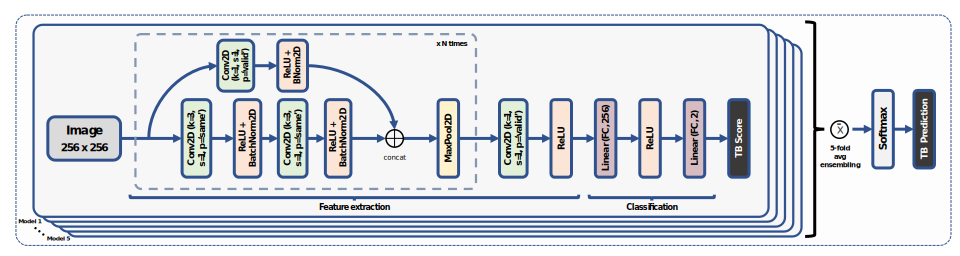

# LightTBNet
LightTBNet: A lightweight, rapid and efficient deep convolutional network for chest X-ray tuberculosis detection

[arXiv](https://doi.org/10.48550/arXiv.2309.02140)  |  [Paper](https://doi.org/10.1109/ISBI53787.2023.10230500)

## Introduction
Tuberculosis (TB) is still recognized as one of the leading causes of death worldwide. Recent advances in deep learning (DL) have shown to enhance radiologists' ability to interpret chest X-ray (CXR) images accurately and with fewer errors, leading to a better diagnosis of this disease. However, little work has been done to develop models capable of diagnosing TB that offer good performance while being efficient, fast and computationally inexpensive. In this work, we propose LightTBNet, a novel lightweight, fast and efficient deep convolutional network specially customized to detect TB from CXR images. Using a total of 800 frontal CXR images from two publicly available datasets, our solution yielded an accuracy, F1 and area under the ROC curve (AUC) of 0.906, 0.907 and 0.961, respectively, on an independent test subset. The proposed model demonstrates outstanding performance while delivering a rapid prediction, with minimal computational and memory requirements, making it highly suitable for deployment in handheld devices that can be used in low-resource areas with high TB prevalence.

<p align="center">

</p>

---
## Table of Contents

- [Introduction](#introduction)
- [Table of Contents](#table-of-contents)
- [Installation](#installation)
- [Usage](#usage)
    - [Custom dataset](#custom-dataset)
    - [Training](#training)
    - [Testing](#testing)
    - [Useful Tips and Considerations](#useful-tips-and-considerations)
- [How to cite](#how-to-cite)
- [License](#license)

---
## Installation

We highly recommend creating a virtual environment for this task. Please follow the next steps:

1. Clone this repository to your computer and create a virtual environment. We highly recommend using Anaconda, which should be installed before these next steps:
    ```bash
    git clone https://github.com/dani-capellan/LightTBNet.git
    cd LightTBNet
    bash install_environment.sh
    conda activate cxr
    ```

2. (Optional) If you wish to use pretrained weights, you may download them from [here](docs/models.md).

---
## Usage

### Custom dataset

You can use your own dataset by following the next steps:

1. Create a CSV with your custom dataset (see `data -> dataset.csv` and follow the same format). The split of the data should be already done at this point (column `split` and `fold_cv`(if cross-validation) contain this information).

2. Create a pickle file (`.pkl`) with a Python dict containing the images in numpy arrays the following way:

    ```
    dict: {
        <filename1>: <Numpy Array1, 256x256>,
        <filename2>: <Numpy Array2, 256x256>,
        <filename3>: <Numpy Array3, 256x256>,
        ...
        <filenameN>: <Numpy ArrayN, 256x256>,
    }
    ```
    Where `<filename>` corresponds to the value of the filename field that appears in the corresponding row of the dataset (CSV). This is done this way to facilitate data access and to allow faster training than accessing and preprocessing the images at each step.

### Training

In order to carry out a training process, we will have to:

1. Configure (hyper)parameters in `config_train.yaml`. This file contains all the configurations regarding the training process. A default and functional version is already provided to you. We encourage users to experiment with different configurations.

2. Use the following command:

    ```bash
    python train.py
    ```

3. If the output training directory is kept as the default, you can check the results and model checkpoints in `results` directory.

### Testing

In order to test one or more trained models on our data, we will need to:

1. Configure parameters in `config_test.yaml`. This file contains all the configurations regarding the testing process. A default and functional version is already provided to you. We encourage users to experiment with different configurations.

2. Use the following command:

    ```bash
    python test.py
    ```

3. If the output testing directory is kept as the default, you can check the results in `results_test` directory.

### Useful Tips and Considerations

- By default, preprocessing with CLAHE is applied to the input images. If CLAHE is not desired in the preprocessing step, change the `clahe -> enabled` parameter in the corresponding config file.

- To select a specific GPU in which to carry out the training or testing process, use `CUDA_VISIBLE_DEVICES=0,1,...` at the beggining of the command. Example:

    ```bash
    CUDA_VISIBLE_DEVICES=0 python train.py
    ```

    or

   ```bash
    CUDA_VISIBLE_DEVICES=0 python train.py
    ```

- The program won't take into account the columns `patient_id`, `age_yo` and `sex` columns from the input CSV file that describes our dataset. You can omit that data or put them to 0. Moreover, if cross validation (CV) is enabled, please make sure that `fold_cv` column is properly included in the CSV.

- Suggested file naming for custom datasets: `<COHORT IDENTIFIER>_<CASE_IDENTIFIER>.<FORMAT>`. Example: `COH_001.jpg`

---
## How to cite

Please cite us if you are using this code!

```
D. Capellán-Martín, J. J. Gómez-Valverde, D. Bermejo-Peláez and M. J. Ledesma-Carbayo, "A Lightweight, Rapid and Efficient Deep Convolutional Network for Chest X-Ray Tuberculosis Detection," 2023 IEEE 20th International Symposium on Biomedical Imaging (ISBI), Cartagena, Colombia, 2023, pp. 1-5, doi: 10.1109/ISBI53787.2023.10230500.
```

BibTeX format:

```
@INPROCEEDINGS{10230500,
  author={Capellán-Martín, Daniel and Gómez-Valverde, Juan J. and Bermejo-Peláez, David and Ledesma-Carbayo, María J.},
  booktitle={2023 IEEE 20th International Symposium on Biomedical Imaging (ISBI)}, 
  title={A Lightweight, Rapid and Efficient Deep Convolutional Network for Chest X-Ray Tuberculosis Detection}, 
  year={2023},
  volume={},
  number={},
  pages={1-5},
  doi={10.1109/ISBI53787.2023.10230500}}
```

DOI: https://doi.org/10.1109/ISBI53787.2023.10230500

---
## License
    
Shield: [![CC BY-NC-SA 4.0][cc-by-nc-sa-shield]][cc-by-nc-sa]

This work is licensed under a
[Creative Commons Attribution-NonCommercial-ShareAlike 4.0 International License][cc-by-nc-sa].

[![CC BY-NC-SA 4.0][cc-by-nc-sa-image]][cc-by-nc-sa]

[cc-by-nc-sa]: http://creativecommons.org/licenses/by-nc-sa/4.0/
[cc-by-nc-sa-image]: https://licensebuttons.net/l/by-nc-sa/4.0/88x31.png
[cc-by-nc-sa-shield]: https://img.shields.io/badge/License-CC%20BY--NC--SA%204.0-lightgrey.svg
